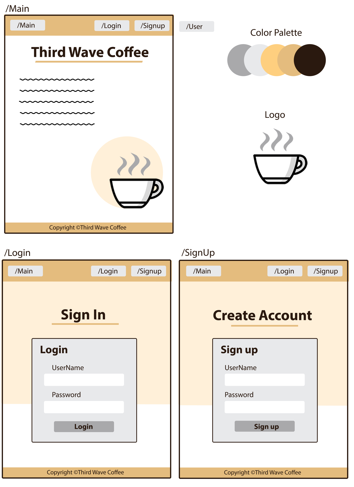
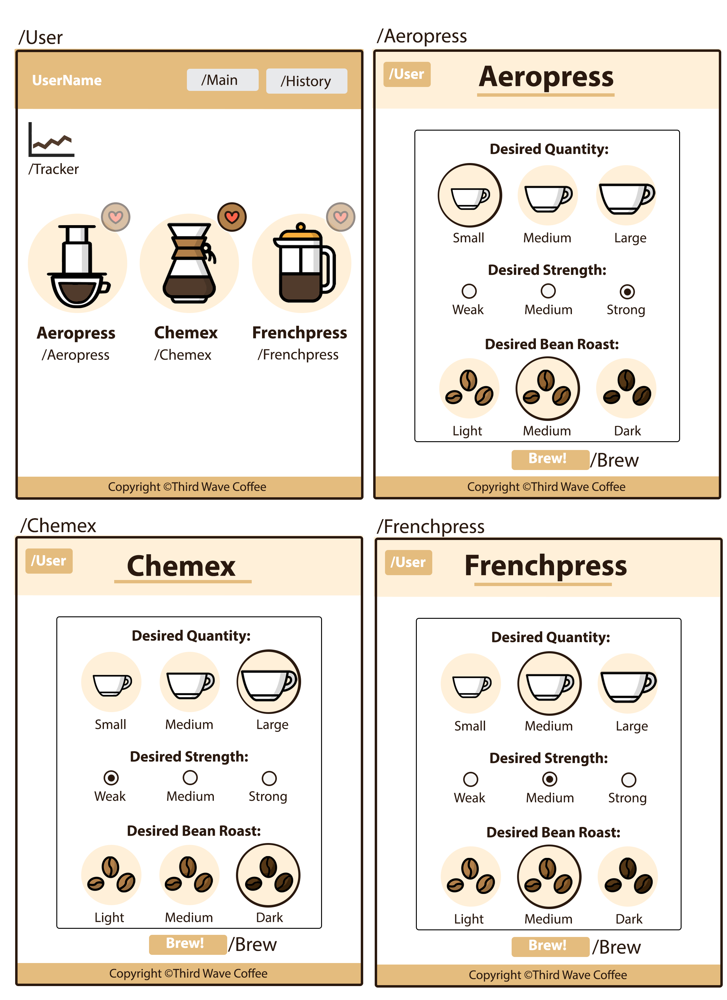
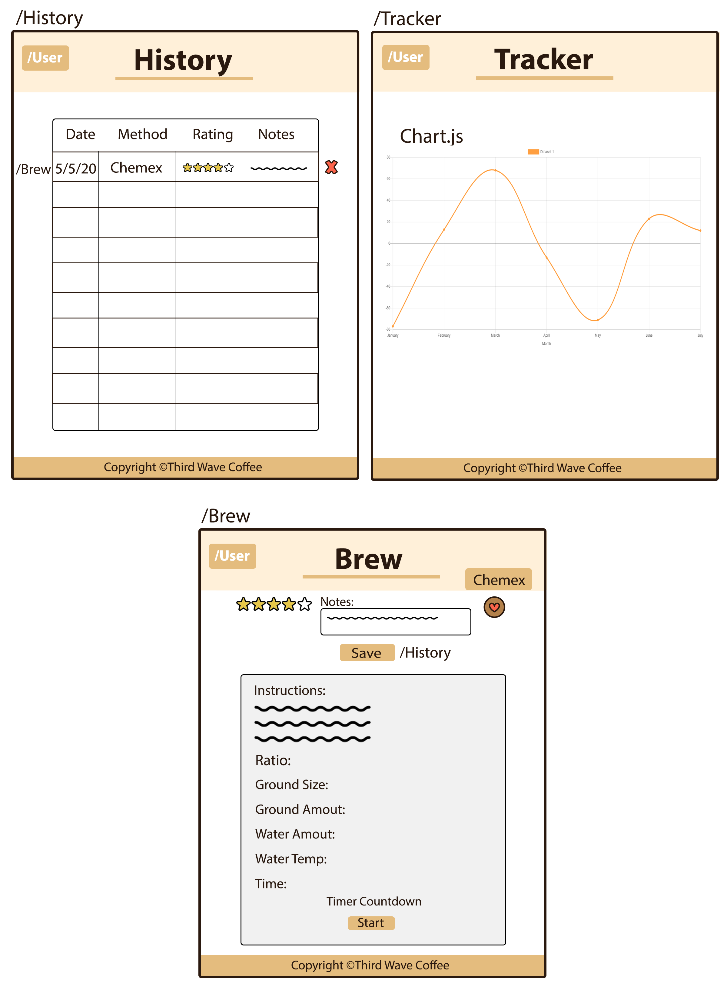
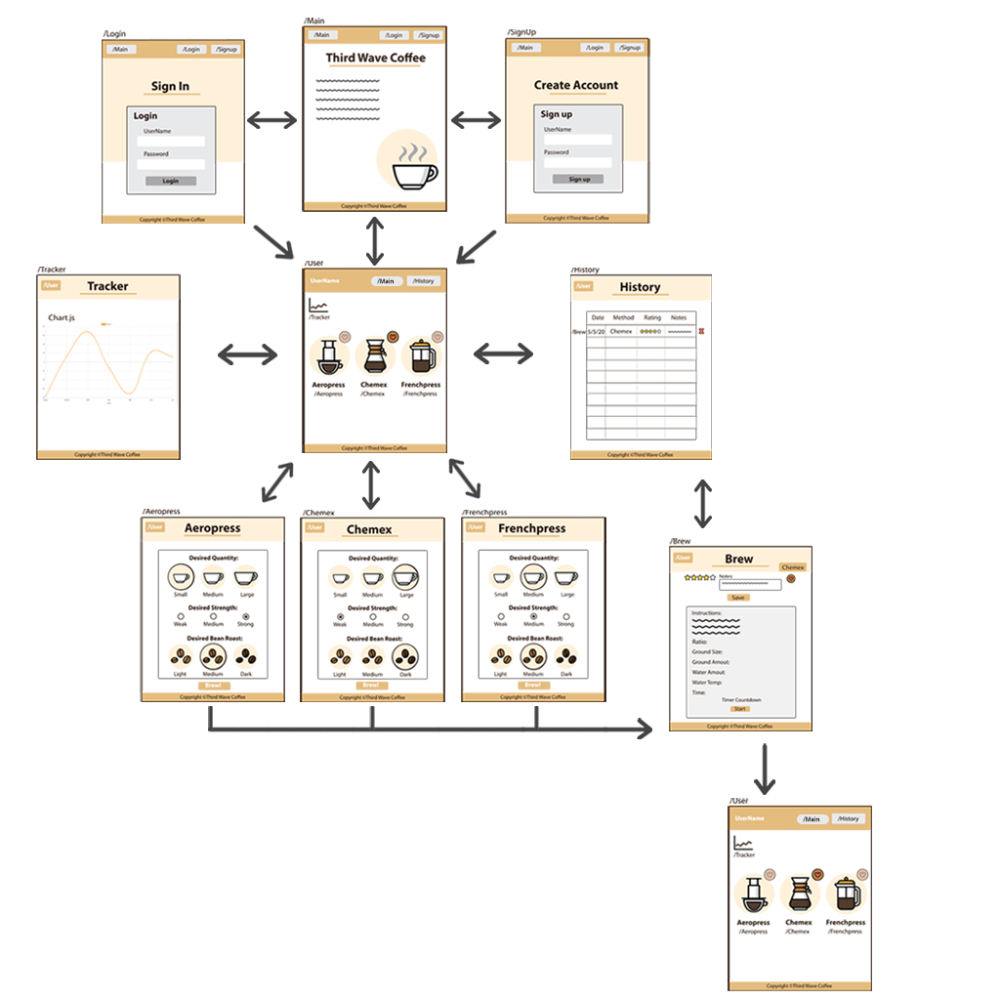

# Third Wave Coffee   :coffee: A Full Stack MERN App

 Many aspiring coffee lovers want to partake in the third wave coffee movement and enjoy quality coffee at home using their own home-brewing devices. Third Wave Coffee App caters to the beginner who is interested in creating coffee at home, but is new to many terms, devices, ideal brewing ratios, ect.


  # User Story
  > As a USER, I want a simple step by step guide for beginners so that I can brew high quality coffee at home  and experiment with different roasts, brew ratios, ground sizes, ect.

  # Acceptance Criteria
  ```
  GIVEN I want a cup of coffee
  WHEN I choose a brew method and preferences
  THEN I will be presented with a calculated brew ratio, time, course size, and water temperature  
  
  GIVEN I have been creating and consuming coffee drinks
  WHEN I want to review my creations
  THEN I should be able to view my drinks history

  GIVEN I have want to edit, add, or delete my history
  WHEN I view my drinks history
  THEN I should be able to give a drink a rating, write notes, delete a drink, or update ratings and notes

```  

 # Technologies
 * HTML & CSS
 * React
 * MongoDB
 * Mongoose ODM
 * Node.js
 * Express
 * JavaScript
 * Bootstrap
 * NPM:
   * axios
   * concurrently
   * express
   * nodemon
   * mongoose
   * jsonwebtoken
   * if-env
   * bcryptjs
   * @hapi/joi
   * if-env
   * dotenv
   * react
   * react-dom
   * react-router-dom
   * react-scripts

# Features & Information

This application follows the MVC paradigm, follows good quality coding standards, contains full CRUD functionality, and authenticates users. Users passwords are hashed as well as encrypted in a JSON Web Token. Environmental variables are also hidden. Users can securly login and keep track of their coffee creations.
  
  # Wireframes
## 
  >
 
## 
  >

## 
 >

# Flow Chart


