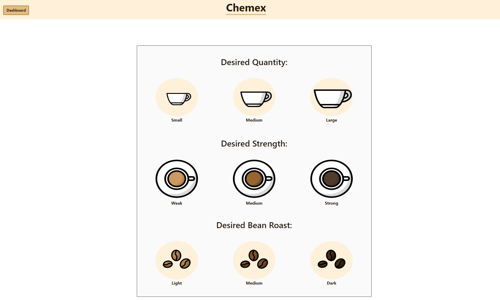
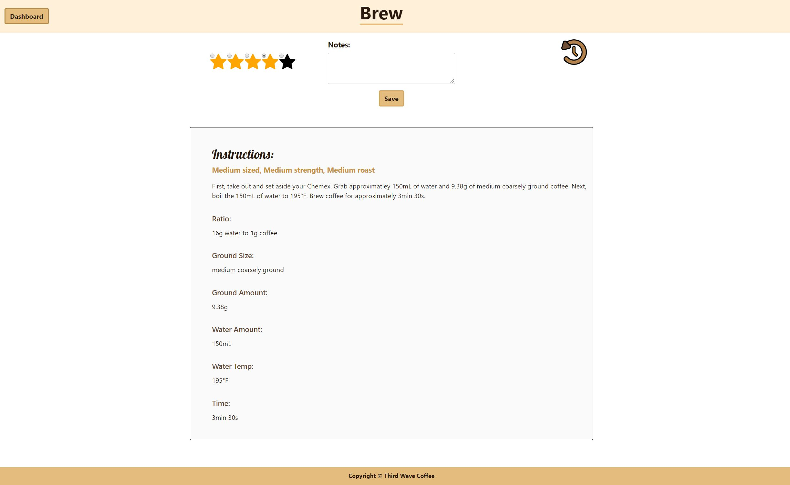

# Third Wave Coffee :coffee: A Full Stack MERN App

Welcome to Third Wave Coffee App! The third wave of coffee is basically a movement where coffee is not just a commodity and instead, there is more to coffee than just caffeine. It's about the exploration and appreciation of what tastes there are and recognizing that there are so many varied tastes from different coffee beans and brewing methods.

Many aspiring third wave coffee lovers want to partake in this movement and enjoy quality coffee at home using their own home-brewing devices. Third Wave Coffee App caters to the beginner who is interested in creating coffee at home, but is new to many terms, devices, ideal brewing ratios, etc.

So, if you're interested in enjoying high quality coffee at home using your own devices, but are now to the "coffee world", then this app is for you!

# Deployed Application

Try it out!
[Third Wave Coffee](https://third-wave-coffee-app.herokuapp.com/)

# User Story

> As a USER, I want a simple step by step guide for beginners so that I can brew high quality coffee at home and experiment with different roasts, brew ratios, ground sizes, etc.

# Acceptance Criteria

```
GIVEN I want a cup of coffee
WHEN I choose a brew method and preferences
THEN I will be presented with a calculated brew ratio, time, course size, and water temperature

GIVEN I have been creating and consuming coffee drinks
WHEN I want to review my creations
THEN I should be able to view my drinks history

GIVEN I have to edit, add, or delete my history
WHEN I view my drinks history
THEN I should be able to give a drink a rating, write notes, delete a drink, or update ratings and notes

```

# Technologies

- Animate.css
- Bootstrap
- Express
- MongoDB
- Mongoose ODM
- HTML & CSS
- JavaScript
- jQuery
- Node.js
- NPM:
  - axios
  - chart.js
  - concurrently
  - bcryptjs
  - dotenv
  - express
  - @hapi/joi
  - if-env
  - jsonwebtoken
  - mongoose
  - nodemon
  - react
  - react-dom
  - react-router-dom
  - react-scripts
  - react-tooltip
- REACT

# Features & Information

This application follows the MVC paradigm, follows good quality coding standards, contains full CRUD functionality, and authenticates users. Users passwords are hashed as well as encrypted in a JSON Web Token. Environmental variables are also hidden. Users can securly login and keep track of their coffee creations.

# Preview

> 

> 

> 

> 

> 

> 

# Wireframes

> 

##

> 

##

> 

# Flow Chart

> 
